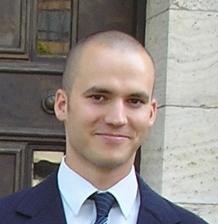

My name is Jan Hrček and since 2009 I hold a master's degree in Computer Science from Masaryk University, [Faculty of Informatics].

Currently I work as a Senior Quality Engineer at [Red Hat] in Brno, Czech Republic.
I am a member of RHBA Quality Assurance team responsible for quality of
[RHDM] and [RHBA] products, which are based on [KIE Group] open-source projects.

My job role involves close collaboration with project management and developers on many tasks throughout project life cycle which includes:

 * product specification
 * pull request reviews
 * development, maintenance and execution of automated test suites
 * reporting of bugs found and verification of bug fixes
 * overseeing and consulting with junior team members

I am experienced Java programmer, holder of *Oracle Certified Associate, Java SE 7 Programmer* and *Oracle Certified Professional, Java SE 7 Programmer* certificates. I am also Functional Programming enthusiast with several years of experience using [Haskell] and [Elm] languages in hobby and work-related [projects](/projects.html). Here is an incomplete list of software and technologies I use on daily basis and am comfortable/proficient with: Linux (mostly Fedora and occasionally playing with Nix), Java, Maven, Git, Jenkins, Jira, GWT (Google Web Toolkit), Selenium, HTML, CSS, Haskell (GHCi, Stack), Elm, Graphviz, Docker, SQL, Relational databases (PostgreSQL, SQLite), IntelliJ IDEA, Atom, Vim ...

I also love learning stuff about Mathematics, in particular Algebra, Combinatorics, Graph Theory and Category Theory.
I have a long lasting interest in theory that makes it possible to create more robust and reliable software.

I am native Czech speaker, but am also fluent in English (holder of Cambridge *FCE* certificate) and I am intermediate German speaker.

You can find more about me in my [LinkedIn] and [GitHub] profiles.

[Elm]: http://elm-lang.org/
[Faculty of Informatics]: https://www.muni.cz/en/about-us/organizational-structure/faculty-of-informatics
[GitHub]: https://github.com/jhrcek
[Haskell]: https://www.haskell.org/
[LinkedIn]: https://www.linkedin.com/in/jan-hrcek-b5147822/
[Red Hat]: https://www.redhat.com/en
[RHDM]: https://www.redhat.com/en/technologies/jboss-middleware/decision-manager
[RHBA]: https://www.redhat.com/en/technologies/jboss-middleware/process-automation-manager
[KIE Group]: http://www.kiegroup.org/
